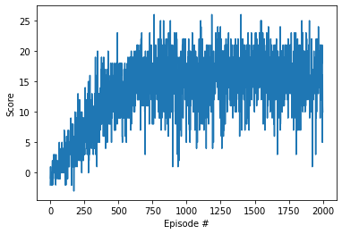
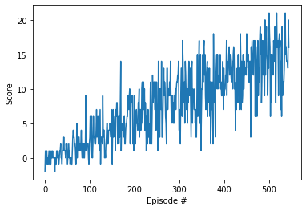

[//]: # (Image References)

[image1]: https://user-images.githubusercontent.com/10624937/42135619-d90f2f28-7d12-11e8-8823-82b970a54d7e.gif "Trained Agent"

# Project 1: Navigation

### Introduction

In this project an agent is trained to navigate (and collect bananas!) in a large, square world.  

![Trained Agent][image1]

A reward of +1 is provided for collecting a yellow banana, and a reward of -1 is provided for collecting a blue banana.  Thus, the goal of the agent is to collect as many yellow bananas as possible while avoiding blue bananas.  

The state space has 37 dimensions and contains the agent's velocity, along with ray-based perception of objects around agent's forward direction.  Given this information, the agent has to learn how to best select actions.  Four discrete actions are available, corresponding to:
- **`0`** - move forward.
- **`1`** - move backward.
- **`2`** - turn left.
- **`3`** - turn right.

The task is episodic, and in order to solve the environment, the agent must get an average score of +13 over 100 consecutive episodes.

### Getting Started

1. Download the environment from one of the links below.  You need only select the environment that matches your operating system:
    - Linux: [click here](https://s3-us-west-1.amazonaws.com/udacity-drlnd/P1/Banana/Banana_Linux.zip)
    - Mac OSX: [click here](https://s3-us-west-1.amazonaws.com/udacity-drlnd/P1/Banana/Banana.app.zip)
    - Windows (32-bit): [click here](https://s3-us-west-1.amazonaws.com/udacity-drlnd/P1/Banana/Banana_Windows_x86.zip)
    - Windows (64-bit): [click here](https://s3-us-west-1.amazonaws.com/udacity-drlnd/P1/Banana/Banana_Windows_x86_64.zip)
    
    (_For Windows users_) Check out [this link](https://support.microsoft.com/en-us/help/827218/how-to-determine-whether-a-computer-is-running-a-32-bit-version-or-64) if you need help with determining if your computer is running a 32-bit version or 64-bit version of the Windows operating system.

    (_For AWS_) If you'd like to train the agent on AWS (and have not [enabled a virtual screen](https://github.com/Unity-Technologies/ml-agents/blob/master/docs/Training-on-Amazon-Web-Service.md)), then please use [this link](https://s3-us-west-1.amazonaws.com/udacity-drlnd/P1/Banana/Banana_Linux_NoVis.zip) to obtain the environment.

2. Place the file in the DRLND GitHub repository, in the `p1_navigation/` folder, and unzip (or decompress) the file. 

3. Set conda environment `conda activate drlnd` prior to running `python main.py`, or change kernel to `drlnd` when running the code from `jupyter notebook`.
### Instructions

Follow the instructions in `Navigation.ipynb` to explore the environment, train and test the agent. 

#### Results and Further Improvements
- The agent was trained with a simple DDQN with local and target Neural Networks consisting of two hidden layers, each with 37 neurons (the number of dimensions of the environment space) followed byt an output layer of 4 neurons (the number of the actions the agent can take).
- As shown in the fig 1, the agent score increasingly improves up to about 500 episodes.
- The trained agent was then tested through 10 episodes and the average performance score was between 10 and 20.

- Fig 1 - The agent scores trained through up to 2000 episodes with the goal of achieving the maximal score of 20.
 
- Fig 2 - The agents scores trained through up to 2000 episodes with the goal of achieving the maximal score of 14.
* Further improvements:
  * Perform hyper parameter tuning to achieve a better fitting of the NN model. These parameters are:
    * replay buffer size
    * Gamma - reward discount factor
    * Epsilon - epsilon-greedy action selection (that is, changing the ratio of exploitation vs. exploration)
    * Epsilon decay rate
    * Tau - for soft update of target parameters
    * learning rate
    * how often is the target NN gets updated
  * Apply different NN models like D3QN
