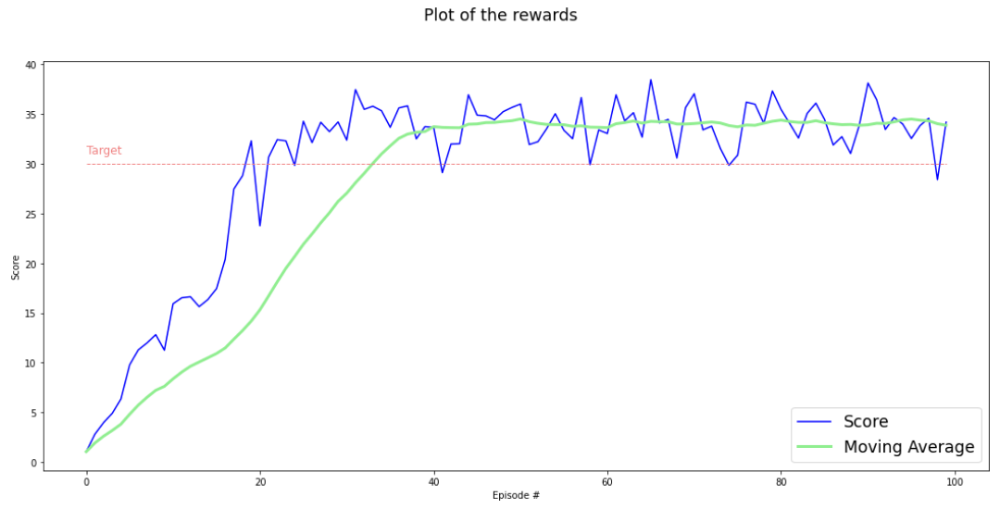

[//]: # (Image References)

[image1]: https://user-images.githubusercontent.com/10624937/43851024-320ba930-9aff-11e8-8493-ee547c6af349.gif "Trained Agent"
[image2]: https://user-images.githubusercontent.com/10624937/43851646-d899bf20-9b00-11e8-858c-29b5c2c94ccc.png "Crawler"

# Project 2: Continuous Control

### Introduction

This project is about solving the [Reacher](https://github.com/Unity-Technologies/ml-agents/blob/master/docs/Learning-Environment-Examples.md#reacher) environment.

![Trained Agent][image1]

In this environment, a double-jointed arm moves to a goal locations. A reward of +0.1 is provided for each step that the agent's hand is in the goal location. Thus, the goal of the agent is to maintain its position at the target location for as many time steps as possible.

- The observation space consists of 33 variables corresponding to position, rotation, velocity, and angular velocities of the arm. 
- Each action is a vector with four numbers, corresponding to torque applicable to two joints. Every entry in the action vector should be a number between -1 and 1.

This means that environment requires the agent to learn from high dimensional state space and perform actions in continuous action space.

### Distributed Training

For this project, two separate versions of the Unity environment has been provided:
- The first version contains a single agent (`Reacher_Linux_1_agent`).
- The second version contains 20 identical agents, each with its own copy of the environment (`Reacher_Linux_20_agents`)  

The second version is useful for distributed algorithms like [PPO](https://arxiv.org/pdf/1707.06347.pdf), [A3C](https://arxiv.org/pdf/1602.01783.pdf), and [D4PG](https://openreview.net/pdf?id=SyZipzbCb) that use multiple (non-interacting, parallel) copies of the same agent to distribute the task of gathering experience.  

### Solving the Environment

Note that in this project the second Unity version containing 20 identical agents has been used.
The task is episodic, and in order to solve the environment, the agent must get an average score of +30 over 100 consecutive episodes.
All 20 agents must get an average score of +30 over 100 consecutive episodes.  
Specifically,
- After each episode, we add up the rewards that each agent received (without discounting), to get a score for each agent.  This yields 20 (potentially different) scores.  We then take the average of these 20 scores. 
- This yields an **average score** for each episode (where the average is over all 20 agents).

The environment is considered solved, when the average over 100 episodes of those average scores is at least +30. 

### Getting Started
1. Follow the instructions `Continuous_Control.ipynb` to explore the environment and train the agent.

2. Download the environment from one of the links below.  You need only select the environment that matches your operating system:

    - **_Version 1: One (1) Agent_**
        - Linux: [click here](https://s3-us-west-1.amazonaws.com/udacity-drlnd/P2/Reacher/one_agent/Reacher_Linux.zip)
        - Mac OSX: [click here](https://s3-us-west-1.amazonaws.com/udacity-drlnd/P2/Reacher/one_agent/Reacher.app.zip)
        - Windows (32-bit): [click here](https://s3-us-west-1.amazonaws.com/udacity-drlnd/P2/Reacher/one_agent/Reacher_Windows_x86.zip)
        - Windows (64-bit): [click here](https://s3-us-west-1.amazonaws.com/udacity-drlnd/P2/Reacher/one_agent/Reacher_Windows_x86_64.zip)

    - **_Version 2: Twenty (20) Agents_**
        - Linux: [click here](https://s3-us-west-1.amazonaws.com/udacity-drlnd/P2/Reacher/Reacher_Linux.zip)
        - Mac OSX: [click here](https://s3-us-west-1.amazonaws.com/udacity-drlnd/P2/Reacher/Reacher.app.zip)
        - Windows (32-bit): [click here](https://s3-us-west-1.amazonaws.com/udacity-drlnd/P2/Reacher/Reacher_Windows_x86.zip)
        - Windows (64-bit): [click here](https://s3-us-west-1.amazonaws.com/udacity-drlnd/P2/Reacher/Reacher_Windows_x86_64.zip)
    
    (_For Windows users_) Check out [this link](https://support.microsoft.com/en-us/help/827218/how-to-determine-whether-a-computer-is-running-a-32-bit-version-or-64) if you need help with determining if your computer is running a 32-bit version or 64-bit version of the Windows operating system.

    (_For AWS_) If you'd like to train the agent on AWS (and have not [enabled a virtual screen](https://github.com/Unity-Technologies/ml-agents/blob/master/docs/Training-on-Amazon-Web-Service.md)), then please use [this link](https://s3-us-west-1.amazonaws.com/udacity-drlnd/P2/Reacher/one_agent/Reacher_Linux_NoVis.zip) (version 1) or [this link](https://s3-us-west-1.amazonaws.com/udacity-drlnd/P2/Reacher/Reacher_Linux_NoVis.zip) (version 2) to obtain the "headless" version of the environment.  You will **not** be able to watch the agent without enabling a virtual screen, but you will be able to train the agent.  (_To watch the agent, you should follow the instructions to [enable a virtual screen](https://github.com/Unity-Technologies/ml-agents/blob/master/docs/Training-on-Amazon-Web-Service.md), and then download the environment for the **Linux** operating system above._)

3. Place the file in the DRLND GitHub repository, in the `p2_continuous-control/` folder, and unzip (or decompress) the file. 

4. Change the kernel to `drlnd` when running the code from jupyter notebook.

### Instructions

Follow the instructions in `Continuous_Control.ipynb` to get started with training your own agent!  

### Results

The agent was trained with a Deep Deterministic Policy Gradient [DDPG](https://lilianweng.github.io/lil-log/2018/04/08/policy-gradient-algorithms.html#ddpg) algorithm introduced by Lillicrap et al.
The DDPG is an algorithm which concurrently learns a Q-function and a policy. It uses off-policy data and the Bellman equation to learn the Q-function, and uses the Q-function to learn the policy.
It is a model free, off-policy _actor-critic_ algorithm that uses deep neural networks to learn policies in high-dimensional, continuous action spaces.

#### Actor and Critic Networks
The actor network takes state as input and returns the action whereas the critic network takes state and action as input and returns the value. 
Both, actor and critic use two neural networks: local and target.
The local networks are trained by sampling experiences (S;A;R;S') from replay buffer and minimising the loss function.
The training was intentionally extended over 100 episodes in order to prove that there is no score degradation after the target score is met for the first time.

 
- The target reward is achieved after approximately 30 episodes, each having a maximum number of time-steps of 1000.
- The reward remains above the target threshold during the remaining episodes.
Note that the moving average window was 20 episodes long.

#### Hyper Parameters:
    batch_size = 128            # training mini batch size
    buffer_size = int(1e5)      # replay buffer size
    gamma = 0.99                # reward discount rate
    lr_actor = 1e-3             # actor's learning rate
    lr_critic = 1e-3            # critic's learning rate
    tau = 1e-3                  # soft update of target NN parameters
    noise_decay = 0.999         # Ornstein-Uhlenbeck process noise decay
    target_episodes = 100       # target number of training episodes for reaching the target training score
    target_score = 30           # target training score

#### Neural Network Configurations
##### Actor's Local & Target DQN
  - (0): Linear(in_features=33, out_features=400, bias=True)
  - (1): Linear(in_features=400, out_features=300, bias=True)
  - (2): Linear(in_features=300, out_features=4, bias=True)
  
`ReLU` activation functions in the hidden layers; `tanh` activation function in the output layer (since the action space is 4-dimensional)

##### Critic's Local & Target DQN
  - (0): Linear(in_features=33, out_features=400, bias=True)
  - (1): Linear(in_features=404, out_features=300, bias=True)
  - (2): Linear(in_features=300, out_features=1, bias=True)

`ReLU` activation functions in the hidden layers; `sigmoid` activation function in the output layer (the Q-Value)

### Future Ideas for Improving the Agent's Performance:
- Improve the replay buffer by using the [Prioritized Experience Replay](https://arxiv.org/abs/1511.05952) algorithm
- Apply [Distributed Prioritized Experience Replay](https://arxiv.org/abs/1803.00933)
- Try the [Proximal Policy Optimization](https://openai.com/blog/openai-baselines-ppo/) algorithm
- [Curiosity-driven Exploration by Self-supervised Prediction](https://pathak22.github.io/noreward-rl/) 
