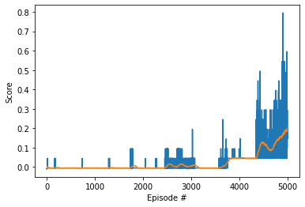
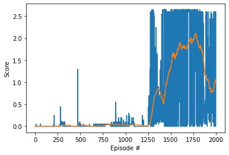
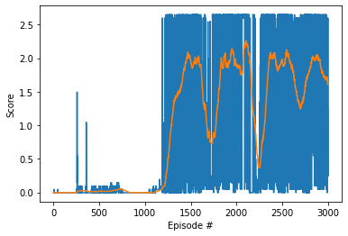

[//]: # (Image References)

[image1]: https://user-images.githubusercontent.com/10624937/42135623-e770e354-7d12-11e8-998d-29fc74429ca2.gif "Trained Agent"
[image2]: https://user-images.githubusercontent.com/10624937/42135622-e55fb586-7d12-11e8-8a54-3c31da15a90a.gif "Soccer"

# Project 3: Collaboration and Competition

### Introduction

This project is about solving the  [Tennis](https://github.com/Unity-Technologies/ml-agents/blob/master/docs/Learning-Environment-Examples.md#tennis) environment.

![Trained Agent][image1]

In this environment, the _meta-agent_ consists of two agents that control rackets to bounce a ball over a net. 
- If an agent hits the ball over the net, it receives a reward of +0.1.  
- If an agent lets a ball hit the ground or hits the ball out of bounds, it receives a reward of -0.01.  

Thus, the goal of each agent is to keep the ball in play.

The observation space consists of 8 variables corresponding to the position and velocity of the ball and racket:
- Each agent receives its own, local observation.  

Two continuous actions are available, corresponding to: 
- movement toward (or away from) the net
- jumping 

The task is episodic, and in order to solve the environment, the agents must get an average score of +0.5 (over 100 consecutive episodes, after taking the maximum over both agents). Specifically,

- After each episode, we add up the rewards that each agent received (without discounting), to get a score for each agent. This yields 2 (potentially different) scores. We then take the maximum of these 2 scores.
- This yields a single **score** for each episode.

The environment is considered solved, when the average (over 100 episodes) of those **scores** is at least +0.5.

### Getting Started

1. Download the environment from one of the links below.  You need only select the environment that matches your operating system:
    - Linux: [click here](https://s3-us-west-1.amazonaws.com/udacity-drlnd/P3/Tennis/Tennis_Linux.zip)
    - Mac OSX: [click here](https://s3-us-west-1.amazonaws.com/udacity-drlnd/P3/Tennis/Tennis.app.zip)
    - Windows (32-bit): [click here](https://s3-us-west-1.amazonaws.com/udacity-drlnd/P3/Tennis/Tennis_Windows_x86.zip)
    - Windows (64-bit): [click here](https://s3-us-west-1.amazonaws.com/udacity-drlnd/P3/Tennis/Tennis_Windows_x86_64.zip)
    
    (_For Windows users_) Check out [this link](https://support.microsoft.com/en-us/help/827218/how-to-determine-whether-a-computer-is-running-a-32-bit-version-or-64) if you need help with determining if your computer is running a 32-bit version or 64-bit version of the Windows operating system.

    (_For AWS_) If you'd like to train the agent on AWS (and have not [enabled a virtual screen](https://github.com/Unity-Technologies/ml-agents/blob/master/docs/Training-on-Amazon-Web-Service.md)), then please use [this link](https://s3-us-west-1.amazonaws.com/udacity-drlnd/P3/Tennis/Tennis_Linux_NoVis.zip) to obtain the "headless" version of the environment.  You will **not** be able to watch the agent without enabling a virtual screen, but you will be able to train the agent.  (_To watch the agent, you should follow the instructions to [enable a virtual screen](https://github.com/Unity-Technologies/ml-agents/blob/master/docs/Training-on-Amazon-Web-Service.md), and then download the environment for the **Linux** operating system above._)

2. Place the file in the DRLND GitHub repository, in the `p3_collab-compet/` folder, and unzip (or decompress) the file. 

### Instructions

Follow the instructions in `Tennis.ipynb` to get started with training your own agent!  

### Results
Multi-agent DDPG (MADDPG) (Lowe et al., 2017) extends [DDPG](https://lilianweng.github.io/lil-log/2018/04/08/policy-gradient-algorithms.html#ddpg) to an environment where multiple agents are coordinating to complete tasks with only local information. 
In the viewpoint of one agent, the environment is non-stationary as policies of other agents are quickly upgraded and remain unknown. 
The problem can be formalized in the multi-agent version of MDP, also known as Markov games. 
For further details, see [MADDPG algorithm](https://lilianweng.github.io/lil-log/2018/04/08/policy-gradient-algorithms.html#maddpg).

Training was repeated three times using different frequencies of updating the local networks with the target ones during an episode.
That is, performing the target network update after 3, 5, 10 steps (see below the hyper parameter `update_every`)

Training can be considered as completed when the average score reaches a maximum value through a certain number of episodes. 
That is, for `update_every` equal to `5`, at about after `1750` episodes and for `update_every` equal to `10`, after `1500`.
In both cases the average score reaches a maximum of about `2`. 
It does not make sense to proceed with training after the maximum average score is reached:
- There is no further increase on the average score. 
- The bigger the average score the longer an episode. This will lead to excessive long training times. 
 

#### Actor and Critic Neural Networks

The actor network takes state as input and returns the action, whereas the critic network takes state and action as input and returns the value. 
Both, actor and critic use two neural networks (NN): local and target that are shared between the agents that model the two players. 
The local networks are trained by sampling experiences (S;A;R;S') from replay buffer and minimising the loss function. 
The ADAM optimizer is used for minimizing the _loss_.

#### Hyper Parameters:
    buffer_size = int(1e5)  # replay buffer size
    batch_size = 128        # mini-batch size
    gamma = 0.99            # reward discount factor
    tau = 1e-3              # for soft update of target parameters
    lr_actor = 1e-5         # actor's learning rate
    lr_critic = 1e-4        # critic's learning rate
    weight_decay = 0        # NN weight decay (L2 penalty)
    update_every = 10       # number of steps before updating the agent's target networks

#### Neural Network Configurations
##### Actor's Local & Target DQN
1. (  24, 128) - input layer: state space dimension
2. ( 128, 128) - hidden layer
3. ( 128, 128) - hidden layer
4. ( 128,   2) - output layer: action space dimension 

`Leaky ReLU` activation function in the hidden layers; `tanh` activation function in the output layer (the Q value) 

##### Critics's Local & Target DQN
1. (24*2, 128) - input layer: (state space dimension) * (action space dimension)
2. (128, 128) - hidden layer
3. (128, 128) - hidden layer
4. (128, 1) - output layer: Q-value dimension (scalar)

`Leaky ReLU` activation function in the hidden layers; `linear` activation function in the output layer (the Q value) 

### Future Ideas for Improving the Agent's Performance
- The field of Multi-Agent DRLND is a new and evolving one. There is recent research regarding variance reduction in DDPG algorithms that can be also applied in a multi-agent setting. 
It would be interesting to see if [Variance Reduction for Policy Gradient with Action-Dependent Factorized Baselines](https://openreview.net/forum?id=H1tSsb-AW) can be applied in this project.
- Try more advanced algorithms; e.g. [M3DDPG](https://people.eecs.berkeley.edu/~russell/papers/aaai19-marl.pdf) 

